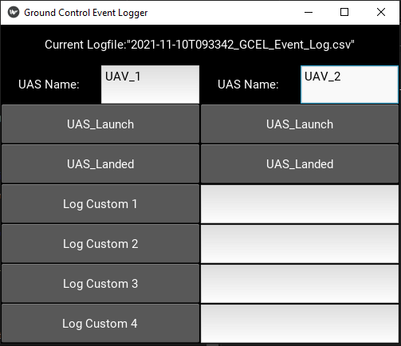

# Ground Control Event Logger

Welcome to the Ground Control Event Logger repository!

This is a tool developed for [ACUASI](https://acuasi.alaska.edu/)
at UAF. It is a simple, extensible, UI that is designed to allow ground control personnel to log events accurately.

# Running
If you are developing the software simply run main.py. The UI is built on kivy

A prepackaged executable is provided for the software at [GCEL.exe](dist/GCEL.exe) 

When run, the UI generates a CSV file with the current time and date. The timestamps are based on your system time, so 
make sure your computer is synced to test site time for timestamp accuracy.